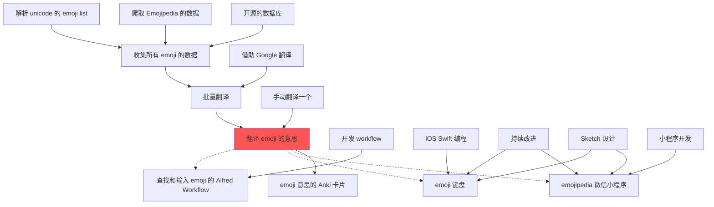

# 001 emoji translation

[link to view](https://mermaidjs.github.io/mermaid-live-editor/#/view/eyJjb2RlIjoiZ3JhcGggVEQ7XG5cbnBhcnNlLXVuaWNvZGUtZW1vamktbGlzdFvop6PmnpAgdW5pY29kZSDnmoQgZW1vamkgbGlzdF0tLT5jb2xsZWN0LWVtb2ppO1xuY3Jhd2wtZW1vamlwZWRpYS1kYXRhW-eIrOWPliBFbW9qaXBlZGlhIOeahOaVsOaNrl0tLT5jb2xsZWN0LWVtb2ppO1xub3BlbnNvdXJjZS1kYlvlvIDmupDnmoTmlbDmja7lupNdLS0-Y29sbGVjdC1lbW9qaTtcbmNvbGxlY3QtZW1vamlb5pS26ZuG5omA5pyJIGVtb2ppIOeahOaVsOaNrl0tLT5iYXRjaC10cmFucztcbnVzZS1nb29nbGUtdHJhbnNb5YCf5YqpIEdvb2dsZSDnv7vor5FdLS0-YmF0Y2gtdHJhbnM7XG7miYvliqjnv7vor5HkuIDkuKotLT50cmFucy1lbW9qaTtcbmJhdGNoLXRyYW5zW-aJuemHj-e_u-ivkV0tLT50cmFucy1lbW9qaTtcbnRyYW5zLWVtb2ppW-e_u-ivkSBlbW9qaSDnmoTmhI_mgJ1dO1xuc3R5bGUgdHJhbnMtZW1vamkgZmlsbDojZjU1O1xuXG50cmFucy1lbW9qaS0uLT5lbW9qaS13b3JrZmxvd1vmn6Xmib7lkozovpPlhaUgZW1vamkg55qEIEFsZnJlZCBXb3JrZmxvd107XG5kZXYtd29ya2Zsb3db5byA5Y-RIHdvcmtmbG93XS0tPmVtb2ppLXdvcmtmbG93O1xuXG50cmFucy1lbW9qaS0uLT5lbW9qaS1rYltlbW9qaSDplK7nm5hdO1xuaW9zLXN3aWZ0W2lPUyBTd2lmdCDnvJbnqItdLS0-ZW1vamkta2I7XG5pbXByb3ZlW-aMgee7reaUuei_m10tLT5lbW9qaS1rYjtcblxuc2tldGNoLWRlc2lnbltTa2V0Y2gg6K6-6K6hXS0tPmVtb2ppLWtiO1xuc2tldGNoLWRlc2lnbltTa2V0Y2gg6K6-6K6hXS0tPmVtb2ppcGVkaWEtY24td2VhcHA7XG5cbnRyYW5zLWVtb2ppLS4tPmVtb2ppcGVkaWEtY24td2VhcHBbZW1vamlwZWRpYSDlvq7kv6HlsI_nqIvluo9dO1xud2VhcHAtZGV2ZWxvcFvlsI_nqIvluo_lvIDlj5FdLS0-ZW1vamlwZWRpYS1jbi13ZWFwcDtcbmltcHJvdmUtLT5lbW9qaXBlZGlhLWNuLXdlYXBwO1xuXG50cmFucy1lbW9qaS0tPmVtb2ppLWNuLWFua2lbZW1vamkg5oSP5oCd55qEIEFua2kg5Y2h54mHXTsiLCJtZXJtYWlkIjp7InRoZW1lIjoiZGVmYXVsdCJ9fQ)

